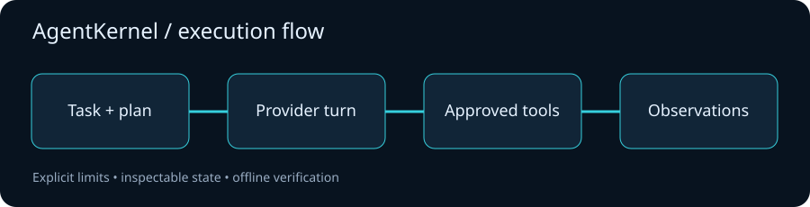

# AgentKernel

**An inspectable tool-calling agent runtime with explicit planning, approvals and budgets.**


AgentKernel implements a small provider-neutral agent loop: plan a bounded task,
request tools, execute registered functions, return their observations to the
provider, and finish with an answer. Ollama supports local inference;
OpenAI-compatible HTTP endpoints support a caller-selected provider. A scripted
provider exercises the same loop offline without claiming to perform AI inference.



## Quick start: no service or API key required

```bash
python -m venv .venv
. .venv/bin/activate
python -m pip install --upgrade pip
python -m pip install -e '.[dev]'
agentkernel --root examples/fixtures
python examples/offline_tools.py
pytest -q
```

The default CLI run is an explicit fixture replay. It executes `list_files` and
prints a plan, answer, token counters and metadata events. It is deterministic,
not a real model run. The second demo calculates and reads a fixture file.

## Live providers

Install and start Ollama independently, download a tool-capable model that fits
your machine, then use its installed model name:

```bash
agentkernel 'Read notes.txt and summarize its action items' \
  --root examples/fixtures --provider ollama --model YOUR_INSTALLED_MODEL
```

For a compatible endpoint, set `AGENTKERNEL_API_KEY` in your shell's environment
and select its URL and model explicitly:

```bash
agentkernel 'Calculate (18 + 24) / 6' --provider compatible \
  --base-url https://YOUR_ENDPOINT/v1 --model YOUR_MODEL \
  --config examples/limits.toml
```

The runtime has no bundled API subscription. A remote provider can charge for
requests; enter its actual prices in the limits file to estimate cost. The
repository's automated verification uses mock HTTP responses, not live inference.

## Real tools and approval

| Tool | Behavior | Approval |
| --- | --- | --- |
| `list_files` | Bounded listing of one directory in the selected root | Read only |
| `read_file` | UTF-8 file read with a byte limit | Read only |
| `calculate` | Bounded numeric arithmetic via an AST interpreter | Read only |
| `write_file` | Atomic UTF-8 file write or replacement in the root | Required |

Writes are denied by default. `--interactive-approval` shows the exact tool call
and requires the literal word `APPROVE` for each write. An application can inject
an async approval callback. Register new tools with a schema and async handler.
There is no shell execution tool.

## Bounded execution

The planner must return 1–8 concrete JSON steps before tools execute. The runtime
limits provider turns, tool calls, reported tokens, serialized context size and
estimated cost. Provider calls have a timeout; tool errors become observations.
A metadata event trail records tool names and outcomes without logging arguments
or file contents. See [runtime contracts](docs/architecture.md).

Cost and token totals are based on provider-reported usage and are checked after
each response. They stop further work but cannot prevent the last request from
exceeding a monetary threshold. Prices default to zero for local/offline use;
zero is not an assertion that a remote endpoint is free.

## Verification and limits

```bash
ruff check .
ruff format --check .
pytest -q
```

Tests cover planning, tool observations, exact write approvals, timeout, budget
limits, path escapes, symlinks, unsafe arithmetic and both provider wire formats.
The root check is an application boundary, not an OS sandbox. Use a directory
containing only material the selected model is allowed to read: model-selected
file content is sent to the provider. A malicious concurrent process replacing
ancestor directories can defeat path preflight. Custom tools need their own
runtime and side-effect controls.

## Roadmap

- Persistent event store and resumable runs.
- Stronger provider-independent schema validation for custom tools.
- Tool isolation using a separate process and OS sandbox.
- Usage admission estimates before a paid provider request.

[Local verification](docs/VERIFICATION.md) · [API reference](docs/API.md) · [Contributing](CONTRIBUTING.md) · [Changelog](CHANGELOG.md) · [MIT license](LICENSE)
